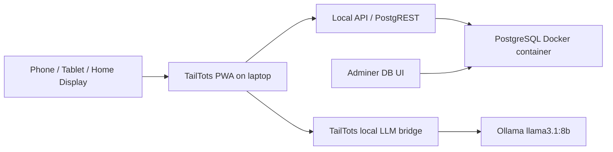

# TailTots Local Laptop Server

This setup makes the laptop act like a small local cloud for TailTots development.

## Services

Frontend app:

- Local browser: `http://localhost:3000`
- Wi-Fi/LAN proxy: `http://192.168.1.126:3001`

Backend platform:

- PostgreSQL database: `localhost:15432`
- PostgREST API: `http://localhost:18000`
- Database admin UI: `http://localhost:18080`
- Local LLM API: `http://localhost:18181`
- Ollama: `http://localhost:11434`

## Start

```powershell
powershell -ExecutionPolicy Bypass -File scripts\start-local-server.ps1
```

## Stop

```powershell
powershell -ExecutionPolicy Bypass -File scripts\stop-local-server.ps1
```

## Adminer Login

Open `http://localhost:18080`.

- System: `PostgreSQL`
- Server: `tailtots-db`
- Username: `tailtots_app`
- Password: `tailtots_local_change_me`
- Database: `tailtots`

## Local LLM Test

```powershell
$body = @{ prompt = "Suggest one child-safe pet care mission." } | ConvertTo-Json
Invoke-RestMethod -Uri http://localhost:18181/api/ai/parent-helper -Method Post -Body $body -ContentType "application/json"
```

## Architecture



## Notes

This is good for development and family testing on your Wi-Fi. Before public hosting, replace local passwords, add real parent authentication, configure HTTPS, and move secrets out of client-visible files.
